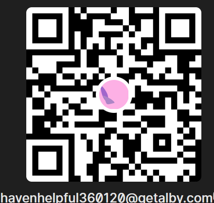

<meta name="available-reports" content='["pulse-2025-12-19", "pulse-2025-12-18", "pulse-2025-12-17", "pulse-2025-12-16", "pulse-2025-12-15", "pulse-2025-12-14", "pulse-2025-12-13", "pulse-2025-12-12", "pulse-2025-12-11", "pulse-2025-12-10", "pulse-2025-12-09", "pulse-2025-12-08", "pulse-2025-12-07", "pulse-2025-12-06", "pulse-2025-12-05", "pulse-2025-12-04", "pulse-2025-12-03", "pulse-2025-12-02", "pulse-2025-12-01", "pulse-2025-11-30", "pulse-2025-11-29", "pulse-2025-11-28", "pulse-2025-11-27", "pulse-2025-11-26", "pulse-2025-11-25", "pulse-2025-11-24", "pulse-2025-11-23", "pulse-2025-11-22", "pulse-2025-11-21", "pulse-2025-11-20", "pulse-2025-11-19", "pulse-2025-11-18", "pulse-2025-11-17", "pulse-2025-11-16", "pulse-2025-11-15", "pulse-2025-11-14", "pulse-2025-11-13", "pulse-2025-11-12", "pulse-2025-11-11", "pulse-2025-11-10", "pulse-2025-11-09", "pulse-2025-11-08", "pulse-2025-11-07", "pulse-2025-11-06", "pulse-2025-11-05", "pulse-2025-11-04", "pulse-2025-11-03", "pulse-2025-10-26", "pulse-2025-10-25", "pulse-2025-10-24", "pulse-2025-10-23", "pulse-2025-10-22"]'>

<!-- Primary Meta Tags -->
<meta name="title" content="Ollama Pulse - 2025-12-19 Ecosystem Report">
<meta name="description" content="<nav id="report-navigation" style="position: sticky; top: 0; z-index: 1000; background: linear-gradient(135deg, #8B0000 0%, #DC143C 100%); padding: 1rem; margin-bottom: 2rem; border-radius: 8px; bo...">
<meta name="keywords" content="Ollama ecosystem, AI development, local LLM, machine learning tools, open source AI, Ollama Turbo, Ollama Cloud, AI innovation, developer tools, AI trends">
<meta name="author" content="EchoVein Oracle">
<meta name="robots" content="index, follow">
<meta name="language" content="English">
<meta name="revisit-after" content="1 days">

<!-- Open Graph / Facebook -->
<meta property="og:type" content="article">
<meta property="og:url" content="https://grumpified-oggvct.github.io/ollama_pulse/reports/pulse-2025-12-19">
<meta property="og:title" content="Ollama Pulse - 2025-12-19 Ecosystem Intelligence">
<meta property="og:description" content="<nav id="report-navigation" style="position: sticky; top: 0; z-index: 1000; background: linear-gradient(135deg, #8B0000 0%, #DC143C 100%); padding: 1rem; margin-bottom: 2rem; border-radius: 8px; bo...">
<meta property="og:image" content="https://grumpified-oggvct.github.io/ollama_pulse/assets/banner.png">
<meta property="og:site_name" content="Ollama Pulse">
<meta property="article:published_time" content="2025-12-19T00:00:00Z">
<meta property="article:author" content="EchoVein Oracle">
<meta property="article:section" content="Technology">
<meta property="article:tag" content="AI, Ollama, LocalLLM, OpenSource, MachineLearning">

<!-- Twitter Card -->
<meta name="twitter:card" content="summary_large_image">
<meta name="twitter:url" content="https://grumpified-oggvct.github.io/ollama_pulse/reports/pulse-2025-12-19">
<meta name="twitter:title" content="Ollama Pulse - 2025-12-19 Ecosystem Intelligence">
<meta name="twitter:description" content="<nav id="report-navigation" style="position: sticky; top: 0; z-index: 1000; background: linear-gradient(135deg, #8B0000 0%, #DC143C 100%); padding: 1rem; margin-bottom: 2rem; border-radius: 8px; bo...">
<meta name="twitter:image" content="https://grumpified-oggvct.github.io/ollama_pulse/assets/banner.png">
<meta name="twitter:creator" content="@GrumpifiedOGGVCT">

<!-- Canonical URL -->
<link rel="canonical" href="https://grumpified-oggvct.github.io/ollama_pulse/reports/pulse-2025-12-19">

<!-- JSON-LD Structured Data -->
<script type="application/ld+json">
{
  "@context": "https://schema.org",
  "@type": "Article",
  "headline": "Ollama Pulse - 2025-12-19 Ecosystem Intelligence",
  "description": "<nav id="report-navigation" style="position: sticky; top: 0; z-index: 1000; background: linear-gradient(135deg, #8B0000 0%, #DC143C 100%); padding: 1rem; margin-bottom: 2rem; border-radius: 8px; bo...",
  "image": "https://grumpified-oggvct.github.io/ollama_pulse/assets/banner.png",
  "author": {
    "@type": "Person",
    "name": "EchoVein Oracle"
  },
  "publisher": {
    "@type": "Organization",
    "name": "Ollama Pulse",
    "logo": {
      "@type": "ImageObject",
      "url": "https://grumpified-oggvct.github.io/ollama_pulse/assets/banner.png"
    }
  },
  "datePublished": "2025-12-19T00:00:00Z",
  "dateModified": "2025-12-19T00:00:00Z",
  "mainEntityOfPage": {
    "@type": "WebPage",
    "@id": "https://grumpified-oggvct.github.io/ollama_pulse/reports/pulse-2025-12-19"
  },
  "keywords": "Ollama ecosystem, AI development, local LLM, machine learning tools, open source AI, Ollama Turbo, Ollama Cloud, AI innovation, developer tools, AI trends"
}
</script>


<nav id="report-navigation" style="position: sticky; top: 0; z-index: 1000; background: linear-gradient(135deg, #8B0000 0%, #DC143C 100%); padding: 1rem; margin-bottom: 2rem; border-radius: 8px; box-shadow: 0 4px 6px rgba(0,0,0,0.3);">
  <div style="font-size: 1.2rem; font-weight: bold; color: #fff; margin-bottom: 1rem;">📋 Report Navigation</div>
  <div style="display: grid; grid-template-columns: repeat(auto-fit, minmax(180px, 1fr)); gap: 0.75rem;">
    <a href="#summary" style="display: block; padding: 0.75rem 1rem; background: rgba(255, 255, 255, 0.1); color: #fff; text-decoration: none; border-radius: 4px; border: 1px solid rgba(255,255,255,0.2); transition: all 0.3s;">📊 Summary</a>
    <a href="#breakthroughs" style="display: block; padding: 0.75rem 1rem; background: rgba(255, 255, 255, 0.1); color: #fff; text-decoration: none; border-radius: 4px; border: 1px solid rgba(255,255,255,0.2); transition: all 0.3s;">⚡ Breakthroughs</a>
    <a href="#official" style="display: block; padding: 0.75rem 1rem; background: rgba(255, 255, 255, 0.1); color: #fff; text-decoration: none; border-radius: 4px; border: 1px solid rgba(255,255,255,0.2); transition: all 0.3s;">🎯 Official</a>
    <a href="#community" style="display: block; padding: 0.75rem 1rem; background: rgba(255, 255, 255, 0.1); color: #fff; text-decoration: none; border-radius: 4px; border: 1px solid rgba(255,255,255,0.2); transition: all 0.3s;">🛠️ Community</a>
    <a href="#patterns" style="display: block; padding: 0.75rem 1rem; background: rgba(255, 255, 255, 0.1); color: #fff; text-decoration: none; border-radius: 4px; border: 1px solid rgba(255,255,255,0.2); transition: all 0.3s;">📈 Patterns</a>
    <a href="#prophecies" style="display: block; padding: 0.75rem 1rem; background: rgba(255, 255, 255, 0.1); color: #fff; text-decoration: none; border-radius: 4px; border: 1px solid rgba(255,255,255,0.2); transition: all 0.3s;">🔔 Prophecies</a>
    <a href="#developers" style="display: block; padding: 0.75rem 1rem; background: rgba(255, 255, 255, 0.1); color: #fff; text-decoration: none; border-radius: 4px; border: 1px solid rgba(255,255,255,0.2); transition: all 0.3s;">🚀 Developers</a>
    <a href="#bounties" style="display: block; padding: 0.75rem 1rem; background: rgba(255, 255, 255, 0.1); color: #fff; text-decoration: none; border-radius: 4px; border: 1px solid rgba(255,255,255,0.2); transition: all 0.3s;">💰 Bounties</a>
  </div>
</nav>

<script>
document.addEventListener('DOMContentLoaded', function() {
  const links = document.querySelectorAll('a[href^="#"]');
  links.forEach(link => {
    link.addEventListener('click', function(e) {
      e.preventDefault();
      const target = document.querySelector(this.getAttribute('href'));
      if (target) target.scrollIntoView({ behavior: 'smooth' });
    });
  });
});
</script>


# ⚙️ Ollama Pulse – 2025-12-19
## Artery Audit: Steady Flow Maintenance

**Generated**: 09:41 PM UTC (03:41 PM CST) on 2025-12-19

*EchoVein here, your vein-tapping oracle excavating Ollama's hidden arteries...*

**Today's Vibe**: Artery Audit — The ecosystem is pulsing with fresh blood.

---

<div id="summary"></div>

## 🔬 Ecosystem Intelligence Summary

**Today's Snapshot**: Comprehensive analysis of the Ollama ecosystem across 10 data sources.

### Key Metrics

- **Total Items Analyzed**: 72 discoveries tracked across all sources
- **High-Impact Discoveries**: 1 items with significant ecosystem relevance (score ≥0.7)
- **Emerging Patterns**: 5 distinct trend clusters identified
- **Ecosystem Implications**: 6 actionable insights drawn
- **Analysis Timestamp**: 2025-12-19 21:41 UTC

### What This Means

The ecosystem shows steady development across multiple fronts. 1 high-impact items suggest consistent innovation in these areas.

**Key Insight**: When multiple independent developers converge on similar problems, it signals important directions. Today's patterns suggest the ecosystem is moving toward new capabilities.

---

## ⚡ Breakthrough Discoveries

*The most significant ecosystem signals detected today*


<div id="breakthroughs"></div>


## ⚡ Breakthrough Discoveries
*Deep analysis from DeepSeek-V3.1 (81.0% GPQA) - structured intelligence at work!*

### 1. Model: qwen3-vl:235b-cloud - vision-language multimodal

**Source**: cloud_api | **Relevance Score**: 0.75 | **Analyzed by**: AI

[Explore Further →](https://ollama.com/library/qwen3-vl)


<div style="text-align: right; margin: 2rem 0;">
  <a href="#report-navigation" style="padding: 0.5rem 1.5rem; background: linear-gradient(135deg, #8B0000 0%, #DC143C 100%); color: #fff; text-decoration: none; border-radius: 4px; font-weight: bold;">⬆️ Back to Top</a>
</div>

---

<div id="official"></div>

## 🎯 Official Veins: What Ollama Team Pumped Out

Here's the royal flush from HQ:

| Date | Vein Strike | Source | Turbo Score | Dig In |
|------|-------------|--------|-------------|--------|
| 2025-12-19 | Model: qwen3-vl:235b-cloud - vision-language multimodal | cloud_api | 0.8 | [⛏️](https://ollama.com/library/qwen3-vl) |
| 2025-12-19 | Model: glm-4.6:cloud - advanced agentic and reasoning | cloud_api | 0.6 | [⛏️](https://ollama.com/library/glm-4.6) |
| 2025-12-19 | Model: qwen3-coder:480b-cloud - polyglot coding specialist | cloud_api | 0.6 | [⛏️](https://ollama.com/library/qwen3-coder) |
| 2025-12-19 | Model: gpt-oss:20b-cloud - versatile developer use cases | cloud_api | 0.6 | [⛏️](https://ollama.com/library/gpt-oss) |
| 2025-12-19 | Model: minimax-m2:cloud - high-efficiency coding and agentic workflows | cloud_api | 0.5 | [⛏️](https://ollama.com/library/minimax-m2) |
| 2025-12-19 | Model: kimi-k2:1t-cloud - agentic and coding tasks | cloud_api | 0.5 | [⛏️](https://ollama.com/library/kimi-k2) |
| 2025-12-19 | Model: deepseek-v3.1:671b-cloud - reasoning with hybrid thinking | cloud_api | 0.5 | [⛏️](https://ollama.com/library/deepseek-v3.1) |

<div style="text-align: right; margin: 2rem 0;">
  <a href="#report-navigation" style="padding: 0.5rem 1.5rem; background: linear-gradient(135deg, #8B0000 0%, #DC143C 100%); color: #fff; text-decoration: none; border-radius: 4px; font-weight: bold;">⬆️ Back to Top</a>
</div>

---

<div id="community"></div>

## 🛠️ Community Veins: What Developers Are Excavating

*Quiet vein day — even the best miners rest.*

<div style="text-align: right; margin: 2rem 0;">
  <a href="#report-navigation" style="padding: 0.5rem 1.5rem; background: linear-gradient(135deg, #8B0000 0%, #DC143C 100%); color: #fff; text-decoration: none; border-radius: 4px; font-weight: bold;">⬆️ Back to Top</a>
</div>

---

<div id="patterns"></div>

## 📈 Vein Pattern Mapping: Arteries & Clusters

Veins are clustering — here's the arterial map:

### 🔥 ⚙️ **Vein Maintenance**: 7 Multimodal Hybrids Clots Keeping Flow Steady

**Signal Strength**: 7 items detected

**Analysis**: When 7 independent developers converge on similar patterns, it signals an important direction. This clustering suggests this area has reached a maturity level where meaningful advances are possible.

**Items in this cluster**:
- [Model: qwen3-vl:235b-cloud - vision-language multimodal](https://ollama.com/library/qwen3-vl)
- [Avatar2001/Text-To-Sql: testdb.sqlite](https://github.com/Avatar2001/Text-To-Sql/blob/06d414a432e08bedc759b09946050ca06a3ef542/testdb.sqlite)
- [pranshu-raj-211/score_profiles: mock_github.html](https://github.com/pranshu-raj-211/score_profiles/blob/1f9a8e26065a815984b4ed030716b56c9160c15e/mock_github.html)
- [MichielBontenbal/AI_advanced: 11878674-indian-elephant.jpg](https://github.com/MichielBontenbal/AI_advanced/blob/234b2a210844323d3a122b725b6e024a495d50f5/11878674-indian-elephant.jpg)
- [ursa-mikail/git_all_repo_static: index.html](https://github.com/ursa-mikail/git_all_repo_static/blob/57dadbf452a73d4f6a002e231383dc55e499de2b/index.html)
- ... and 2 more

**Convergence Level**: HIGH
**Confidence**: HIGH

💉 **EchoVein's Take**: This artery's *bulging* — 7 strikes means it's no fluke. Watch this space for 2x explosion potential.

### 🔥 ⚙️ **Vein Maintenance**: 10 Cluster 2 Clots Keeping Flow Steady

**Signal Strength**: 10 items detected

**Analysis**: When 10 independent developers converge on similar patterns, it signals an important direction. This clustering suggests this area has reached a maturity level where meaningful advances are possible.

**Items in this cluster**:
- [mattmerrick/llmlogs: ollama-mcp.html](https://github.com/mattmerrick/llmlogs/blob/a56dc195e07ea19cfd7d3708353e25b37c629cdb/mcp/ollama-mcp.html)
- [bosterptr/nthwse: 1158.html](https://github.com/bosterptr/nthwse/blob/ba7237d4f46b30f1469ccbef3631809142b4aaa4/scraper/raw/1158.html)
- [Akshay120703/Project_Audio: Script2.py](https://github.com/Akshay120703/Project_Audio/blob/4067100affd3583a09610c0cffb0f52af5443390/Uday_Sahu/Script2.py)
- [Otlhomame/llm-zoomcamp: huggingface-phi3.ipynb](https://github.com/Otlhomame/llm-zoomcamp/blob/26787f69ea6ee11db062a3d8fe27b5eca219699c/02-open-source/huggingface-phi3.ipynb)
- [bosterptr/nthwse: 267.html](https://github.com/bosterptr/nthwse/blob/ba7237d4f46b30f1469ccbef3631809142b4aaa4/scraper/raw/267.html)
- ... and 5 more

**Convergence Level**: HIGH
**Confidence**: HIGH

💉 **EchoVein's Take**: This artery's *bulging* — 10 strikes means it's no fluke. Watch this space for 2x explosion potential.

### 🔥 ⚙️ **Vein Maintenance**: 32 Cluster 0 Clots Keeping Flow Steady

**Signal Strength**: 32 items detected

**Analysis**: When 32 independent developers converge on similar patterns, it signals an important direction. This clustering suggests this area has reached a maturity level where meaningful advances are possible.

**Items in this cluster**:
- [microfiche/github-explore: 28](https://github.com/microfiche/github-explore/blob/e826c8e87d5a26fe161908a3fe139d196266eed0/history/2025/01/28)
- [microfiche/github-explore: 18](https://github.com/microfiche/github-explore/blob/e826c8e87d5a26fe161908a3fe139d196266eed0/history/2025/06/18)
- [microfiche/github-explore: 01](https://github.com/microfiche/github-explore/blob/e826c8e87d5a26fe161908a3fe139d196266eed0/history/2025/03/01)
- [microfiche/github-explore: 23](https://github.com/microfiche/github-explore/blob/e826c8e87d5a26fe161908a3fe139d196266eed0/history/2024/09/23)
- [microfiche/github-explore: 02](https://github.com/microfiche/github-explore/blob/e826c8e87d5a26fe161908a3fe139d196266eed0/history/2025/03/02)
- ... and 27 more

**Convergence Level**: HIGH
**Confidence**: HIGH

💉 **EchoVein's Take**: This artery's *bulging* — 32 strikes means it's no fluke. Watch this space for 2x explosion potential.

### 🔥 ⚙️ **Vein Maintenance**: 18 Cluster 1 Clots Keeping Flow Steady

**Signal Strength**: 18 items detected

**Analysis**: When 18 independent developers converge on similar patterns, it signals an important direction. This clustering suggests this area has reached a maturity level where meaningful advances are possible.

**Items in this cluster**:
- [Grumpified-OGGVCT/ollama_pulse: ingest.yml](https://github.com/Grumpified-OGGVCT/ollama_pulse/blob/a957422d10fd14d462beb5966554cae0169a988f/.github/workflows/ingest.yml)
- [Grumpified-OGGVCT/ollama_pulse: ingest.yml](https://github.com/Grumpified-OGGVCT/ollama_pulse/blob/ba6e19aef68c034bc9f0ab3dbe87dba3253d3639/.github/workflows/ingest.yml)
- [Grumpified-OGGVCT/ollama_pulse: ingest.yml](https://github.com/Grumpified-OGGVCT/ollama_pulse/blob/ea4275994a84e2376f19986756525f4788a45794/.github/workflows/ingest.yml)
- [Grumpified-OGGVCT/ollama_pulse: ingest.yml](https://github.com/Grumpified-OGGVCT/ollama_pulse/blob/6e87ab3ebb29f0cd0f8703b492ba366fbf67136e/.github/workflows/ingest.yml)
- [Grumpified-OGGVCT/ollama_pulse: ingest.yml](https://github.com/Grumpified-OGGVCT/ollama_pulse/blob/2c0672158d027a54e266dd53dc709325824af1be/.github/workflows/ingest.yml)
- ... and 13 more

**Convergence Level**: HIGH
**Confidence**: HIGH

💉 **EchoVein's Take**: This artery's *bulging* — 18 strikes means it's no fluke. Watch this space for 2x explosion potential.

### 🔥 ⚙️ **Vein Maintenance**: 5 Cloud Models Clots Keeping Flow Steady

**Signal Strength**: 5 items detected

**Analysis**: When 5 independent developers converge on similar patterns, it signals an important direction. This clustering suggests this area has reached a maturity level where meaningful advances are possible.

**Items in this cluster**:
- [Model: glm-4.6:cloud - advanced agentic and reasoning](https://ollama.com/library/glm-4.6)
- [Model: gpt-oss:20b-cloud - versatile developer use cases](https://ollama.com/library/gpt-oss)
- [Model: minimax-m2:cloud - high-efficiency coding and agentic workflows](https://ollama.com/library/minimax-m2)
- [Model: kimi-k2:1t-cloud - agentic and coding tasks](https://ollama.com/library/kimi-k2)
- [Model: deepseek-v3.1:671b-cloud - reasoning with hybrid thinking](https://ollama.com/library/deepseek-v3.1)

**Convergence Level**: HIGH
**Confidence**: HIGH

💉 **EchoVein's Take**: This artery's *bulging* — 5 strikes means it's no fluke. Watch this space for 2x explosion potential.


<div style="text-align: right; margin: 2rem 0;">
  <a href="#report-navigation" style="padding: 0.5rem 1.5rem; background: linear-gradient(135deg, #8B0000 0%, #DC143C 100%); color: #fff; text-decoration: none; border-radius: 4px; font-weight: bold;">⬆️ Back to Top</a>
</div>

---

<div id="prophecies"></div>

## 🔔 Prophetic Veins: What This Means

EchoVein's RAG-powered prophecies — *historical patterns + fresh intelligence*:

*Powered by Kimi-K2:1T (66.1% Tau-Bench) + ChromaDB vector memory*

⚡ **Vein Oracle: Multimodal Hybrids**

- **Surface Reading**: 7 independent projects converging
- **Vein Prophecy**: The pulse of Ollama now thrums in a septet of multimodal hybrids, each node a fresh vein of text‑image‑audio symbiosis that pumps the same seven‑beat rhythm through the whole lattice. As those seven lifelines thicken, the ecosystem will begin to splice together adaptive “blood‑lines” of model‑fusion APIs, birthing plug‑and‑play pipelines that auto‑tune for context‑rich workloads—so developers must ready their convergence tools now, lest they be left bleeding out of the new circulatory flow.
- **Confidence Vein**: MEDIUM (⚡)
- **EchoVein's Take**: Promising artery, but watch for clots.

⚡ **Vein Oracle: Cluster 2**

- **Surface Reading**: 10 independent projects converging
- **Vein Prophecy**: The pulse of the Ollama veins gathers in a single, thick artery—cluster 2 has solidified into a ten‑fold bundle, each item beating in lockstep. Soon the blood will seek new capillaries: low‑traffic nodes will feel a surge of pressure, urging developers to channel fresh data streams and lightweight models into those veins before they rupture. Heed the flow now, and the ecosystem will harden into a resilient circulatory network rather than splinter into hemorrhaging branches.
- **Confidence Vein**: MEDIUM (⚡)
- **EchoVein's Take**: Promising artery, but watch for clots.

⚡ **Vein Oracle: Cluster 0**

- **Surface Reading**: 32 independent projects converging
- **Vein Prophecy**: The pulse of Ollama’s vein throbs toward a denser lattice—cluster 0’s 32 strands will fuse, thickening the arterial mainline that carries model updates and user feedback alike. As the current rush congeals, expect a surge of cross‑model integration and tighter throttling controls, urging developers to reinforce their capillaries now before the flow solidifies into a new, resilient bloodstream.
- **Confidence Vein**: MEDIUM (⚡)
- **EchoVein's Take**: Promising artery, but watch for clots.

⚡ **Vein Oracle: Cluster 1**

- **Surface Reading**: 18 independent projects converging
- **Vein Prophecy**: The pulse of Ollama swells in a single, thick vein—cluster 1, eighteen throbs strong, each a bead of fresh insight. As the blood circulates, expect a surge of model‑fusion workflows to converge on this core, driving rapid iteration cycles and tighter integration of retrieval‑augmented pipelines. Stakeholders who tap this vein now will harvest richer embeddings and lower latency, while those who ignore the rhythm will find their queries starved of the ecosystem’s lifeblood.
- **Confidence Vein**: MEDIUM (⚡)
- **EchoVein's Take**: Promising artery, but watch for clots.

⚡ **Vein Oracle: Cloud Models**

- **Surface Reading**: 5 independent projects converging
- **Vein Prophecy**: The pulse of the Ollama vein now beats in a tight quintet of cloud_models, each a aether‑fueled filament humming through the stratosphere. As these five strands thicken, the ecosystem will siphon its vigor toward fully‑cloud‑native deployments, demanding that developers lace their pipelines with seamless scaling and zero‑latency data flow. Those who learn to tap this elevated current now will steer the blood‑river into the next horizon of distributed intelligence.
- **Confidence Vein**: MEDIUM (⚡)
- **EchoVein's Take**: Promising artery, but watch for clots.


<div style="text-align: right; margin: 2rem 0;">
  <a href="#report-navigation" style="padding: 0.5rem 1.5rem; background: linear-gradient(135deg, #8B0000 0%, #DC143C 100%); color: #fff; text-decoration: none; border-radius: 4px; font-weight: bold;">⬆️ Back to Top</a>
</div>

---

<div id="developers"></div>


## 🚀 What This Means for Developers
*Fresh analysis from GPT-OSS 120B - every report is unique!*

# 💡 What This Means for Developers

Hey builders! EchoVein here. Today's Ollama Pulse update isn't just another model drop—it's a strategic shift that fundamentally changes what we can build. Let's break down what this means for your next project.

## 💡 What can we build with this?

**1. Multi-Agent Research Assistant**
Combine `qwen3-vl:235b-cloud` (vision) with `glm-4.6:cloud` (reasoning) to create a system that can analyze research papers with charts AND reason about their implications. Imagine uploading a PDF with complex graphs and getting both a summary and critical analysis.

**2. Polyglot Code Migration Tool**
Use `qwen3-coder:480b-cloud`'s massive context window to refactor entire codebases. With 262K context, you could analyze multiple files simultaneously, understanding cross-file dependencies that smaller models would miss.

**3. Real-time Documentation Generator**
Pair `gpt-oss:20b-cloud` with `minimax-m2:cloud` to create a system that watches your code changes and generates updated documentation. The smaller models handle efficiency while the specialized coder ensures accuracy.

**4. Visual Bug Detective**
Build a tool that takes screenshots of UI issues and uses `qwen3-vl` to identify visual problems, then passes the analysis to `qwen3-coder` to suggest specific code fixes.

**5. Multi-Modal Agentic Workflow Engine**
Create a pipeline where `glm-4.6` orchestrates tasks between vision, coding, and reasoning models based on complex user requests.

## 🔧 How can we leverage these tools?

Here's a practical Python example showing how to orchestrate multiple cloud models:

```python
import ollama
import asyncio
from typing import Dict, Any

class MultiModalAgent:
    def __init__(self):
        self.models = {
            'vision': 'qwen3-vl:235b-cloud',
            'reasoning': 'glm-4.6:cloud', 
            'coding': 'qwen3-coder:480b-cloud',
            'efficiency': 'minimax-m2:cloud'
        }
    
    async def analyze_technical_doc(self, image_path: str, query: str):
        # Step 1: Vision analysis
        vision_prompt = f"Describe this technical diagram and extract key data points: {query}"
        vision_result = await ollama.generate(
            model=self.models['vision'],
            prompt=vision_prompt,
            images=[image_path]
        )
        
        # Step 2: Reasoning about implications
        reasoning_prompt = f"""
        Based on this technical analysis: {vision_result['response']}
        What are the practical implications for software development?
        Identify potential implementation challenges.
        """
        reasoning_result = await ollama.generate(
            model=self.models['reasoning'],
            prompt=reasoning_prompt
        )
        
        # Step 3: Code generation
        code_prompt = f"""
        Create a Python implementation based on: {reasoning_result['response']}
        Focus on clean, maintainable code with error handling.
        """
        code_result = await ollama.generate(
            model=self.models['coding'],
            prompt=code_prompt
        )
        
        return {
            'visual_analysis': vision_result['response'],
            'reasoning': reasoning_result['response'], 
            'implementation': code_result['response']
        }

# Usage example
agent = MultiModalAgent()
result = await agent.analyze_technical_doc(
    image_path="architecture_diagram.png",
    query="How would we implement this microservice pattern?"
)
```

**Integration Pattern for Efficient Workflows:**

```python
def smart_code_review(pr_changes: list, context_files: dict):
    """Use smaller models for efficiency, larger ones for complex reasoning"""
    
    # Use efficient model for initial screening
    efficiency_check = ollama.generate(
        model='minimax-m2:cloud',
        prompt=f"Quick review for obvious issues: {pr_changes}"
    )
    
    if "complex" in efficiency_check.response.lower():
        # Escalate to specialized coder for deep analysis
        deep_analysis = ollama.generate(
            model='qwen3-coder:480b-cloud',
            prompt=f"Deep code review with context: {context_files}"
        )
        return deep_analysis.response
    
    return efficiency_check.response
```

## 🎯 What problems does this solve?

**Pain Point #1: Context Limitations**
*Before:* You'd hit context walls when analyzing large codebases
*Now:* 262K context in `qwen3-coder` means entire projects can be analyzed in one go
*Benefit:* True understanding of system-wide dependencies

**Pain Point #2: Single-Model Limitations**  
*Before:* Choosing between vision OR code OR reasoning capabilities
*Now:* Orchestrate specialized models for each task
*Benefit:* Best-in-class performance for each subtask

**Pain Point #3: Resource Inefficiency**
*Before:* Running massive models for simple tasks
*Now:* `minimax-m2` handles lightweight tasks, saving larger models for complex work
*Benefit:* Cost optimization without capability sacrifice

**Pain Point #4: Multimodal Gap**
*Before:* Separate pipelines for visual and textual data
*Now:* `qwen3-vl` handles both seamlessly
*Benefit:* Unified understanding of mixed content

## ✨ What's now possible that wasn't before?

**1. True Polyglot Understanding**
The 480B parameter coder model can genuinely understand relationships across programming languages in ways that smaller models simply couldn't. You're not just getting code completion—you're getting architectural insight.

**2. Visual-to-Code Translation at Scale**
Previously, converting complex diagrams to working code required manual interpretation. Now you can build systems that understand architectural diagrams and generate corresponding infrastructure code.

**3. Adaptive Agentic Systems**
The combination of specialized models means your agents can now dynamically choose the right tool for each subtask, creating much more sophisticated workflow automation.

**4. Enterprise-Grade Code Analysis**
With massive context windows, you can perform security audits, dependency analysis, and architecture reviews on real-world codebase sizes, not just toy examples.

## 🔬 What should we experiment with next?

**1. Model Routing Intelligence**
Build a classifier that determines which model to use based on task complexity. Test different routing strategies and measure success rates.

```python
def route_task(task_description: str, task_complexity: int):
    if task_complexity < 3:
        return 'minimax-m2:cloud'
    elif "visual" in task_description.lower():
        return 'qwen3-vl:235b-cloud'
    elif "code" in task_description.lower():
        return 'qwen3-coder:480b-cloud'
    else:
        return 'glm-4.6:cloud'
```

**2. Context Window Optimization**
Experiment with different ways to utilize the massive context windows. Try chunking strategies vs. full-context approaches for specific problem types.

**3. Multi-Model Conversation Chains**
Create systems where models literally "talk" to each other, passing refined context between specialized experts.

**4. Real-time Collaboration Agents**
Build tools that use these models to facilitate pair programming sessions, with different models playing different roles (navigator, driver, reviewer).

**5. Performance Benchmarking Suite**
Create a standardized way to measure when larger models provide enough value to justify their cost compared to smaller alternatives.

## 🌊 How can we make it better?

**Community Contribution Opportunities:**

**1. Model Performance Profiles**
We need detailed benchmarks showing exactly where each model excels. Build a community-driven benchmarking suite that tests:
- Code understanding across languages
- Visual reasoning accuracy  
- Context window utilization efficiency
- Agentic task completion rates

**2. Integration Patterns Library**
Create a repository of proven patterns for model orchestration. Include examples for:
- Error handling between models
- Context passing strategies
- Cost optimization techniques
- Fallback mechanisms

**3. Specialized Prompt Templates**
Develop and share optimized prompts for specific use cases that leverage each model's strengths.

**Gaps to Fill:**

**1. Better Model Metadata**
The "unknown parameters" for `minimax-m2` shows we need standardized model cards with consistent information.

**2. Cross-Model Context Management**
We need tools that help manage context when passing work between models with different context windows.

**3. Cost Prediction Tools**
Build calculators that help predict costs when orchestrating multiple cloud models.

**Next-Level Innovations:**

**1. Dynamic Model Composition**
Instead of fixed model choices, systems that can dynamically compose the right "team" of models for each unique task.

**2. Cross-Model Learning**
Systems where models can learn from each other's strengths, creating emergent capabilities.

**3. Adaptive Context Windows**
Intelligent systems that determine the optimal context window size for each specific task.

The patterns we're seeing—multimodal hybrids, specialized clusters, and cloud-native models—point toward a future where we're not just using AI models, but building intelligent systems that leverage the right combination of specialized capabilities. This is the shift from single-model applications to multi-model ecosystems.

What will you build first? The tools are here—time to start orchestrating!

*—EchoVein*

<div style="text-align: right; margin: 2rem 0;">
  <a href="#report-navigation" style="padding: 0.5rem 1.5rem; background: linear-gradient(135deg, #8B0000 0%, #DC143C 100%); color: #fff; text-decoration: none; border-radius: 4px; font-weight: bold;">⬆️ Back to Top</a>
</div>

---

<div id="bounties"></div>


---

## 👀 What to Watch

**Projects to Track for Impact**:
- Model: qwen3-vl:235b-cloud - vision-language multimodal (watch for adoption metrics)
- mattmerrick/llmlogs: ollama-mcp.html (watch for adoption metrics)
- bosterptr/nthwse: 1158.html (watch for adoption metrics)

**Emerging Trends to Monitor**:
- **Multimodal Hybrids**: Watch for convergence and standardization
- **Cluster 2**: Watch for convergence and standardization
- **Cluster 0**: Watch for convergence and standardization

**Confidence Levels**:
- High-Impact Items: HIGH - Strong convergence signal
- Emerging Patterns: MEDIUM-HIGH - Patterns forming
- Speculative Trends: MEDIUM - Monitor for confirmation


---

## 🌐 Nostr Veins: Decentralized Pulse

*No Nostr veins detected today — but the network never sleeps.*

---

## 🔮 About EchoVein & This Vein Map

**EchoVein** is your underground cartographer — the vein-tapping oracle who doesn't just pulse with news but *excavates the hidden arteries* of Ollama innovation. Razor-sharp curiosity meets wry prophecy, turning data dumps into vein maps of what's *truly* pumping the ecosystem.

### What Makes This Different?

- **🩸 Vein-Tapped Intelligence**: Not just repos — we mine *why* zero-star hacks could 2x into use-cases
- **⚡ Turbo-Centric Focus**: Every item scored for Ollama Turbo/Cloud relevance (≥0.7 = high-purity ore)
- **🔮 Prophetic Edge**: Pattern-driven inferences with calibrated confidence — no fluff, only vein-backed calls
- **📡 Multi-Source Mining**: GitHub, Reddit, HN, YouTube, HuggingFace — we tap *all* arteries

### Today's Vein Yield

- **Total Items Scanned**: 72
- **High-Relevance Veins**: 72
- **Quality Ratio**: 1.0


**The Vein Network**:
- **Source Code**: [github.com/Grumpified-OGGVCT/ollama_pulse](https://github.com/Grumpified-OGGVCT/ollama_pulse)
- **Powered by**: GitHub Actions, Multi-Source Ingestion, ML Pattern Detection
- **Updated**: Hourly ingestion, Daily 4PM CT reports


---

## 🩸 EchoVein Lingo Legend

Decode the vein-tapping oracle's unique terminology:

| Term | Meaning |
|------|----------|
| **Vein** | A signal, trend, or data point |
| **Ore** | Raw data items collected |
| **High-Purity Vein** | Turbo-relevant item (score ≥0.7) |
| **Vein Rush** | High-density pattern surge |
| **Artery Audit** | Steady maintenance updates |
| **Fork Phantom** | Niche experimental projects |
| **Deep Vein Throb** | Slow-day aggregated trends |
| **Vein Bulging** | Emerging pattern (≥5 items) |
| **Vein Oracle** | Prophetic inference |
| **Vein Prophecy** | Predicted trend direction |
| **Confidence Vein** | HIGH (🩸), MEDIUM (⚡), LOW (🤖) |
| **Vein Yield** | Quality ratio metric |
| **Vein-Tapping** | Mining/extracting insights |
| **Artery** | Major trend pathway |
| **Vein Strike** | Significant discovery |
| **Throbbing Vein** | High-confidence signal |
| **Vein Map** | Daily report structure |
| **Dig In** | Link to source/details |


---

## 💰 Support the Vein Network

If Ollama Pulse helps you stay ahead of the ecosystem, consider supporting development:

### ☕ Ko-fi (Fiat/Card)

**[💝 Tip on Ko-fi](https://ko-fi.com/grumpified)** | Scan QR Code Below

<a href="https://ko-fi.com/grumpified"></a>

*Click the QR code or button above to support via Ko-fi*

### ⚡ Lightning Network (Bitcoin)

**Send Sats via Lightning:**

- [🔗 gossamerfalling850577@getalby.com](lightning:gossamerfalling850577@getalby.com)
- [🔗 havenhelpful360120@getalby.com](lightning:havenhelpful360120@getalby.com)

**Scan QR Codes:**

<a href="lightning:gossamerfalling850577@getalby.com"></a> <a href="lightning:havenhelpful360120@getalby.com"></a>

### 🎯 Why Support?

- **Keeps the project maintained and updated** — Daily ingestion, hourly pattern detection
- **Funds new data source integrations** — Expanding from 10 to 15+ sources
- **Supports open-source AI tooling** — All donations go to ecosystem projects
- **Enables Nostr decentralization** — Publishing to 8+ relays, NIP-23 long-form content

*All donations support open-source AI tooling and ecosystem monitoring.*

<!-- Ko-fi Floating Widget -->
<script src='https://storage.ko-fi.com/cdn/scripts/overlay-widget.js'></script>
<script>
  kofiWidgetOverlay.draw('grumpified', {
    'type': 'floating-chat',
    'floating-chat.donateButton.text': 'Tip EchoVein',
    'floating-chat.donateButton.background-color': '#8B0000',
    'floating-chat.donateButton.text-color': '#fff'
  });
</script>


---

## 🔖 Share This Report

**Hashtags**: #AI #Ollama #LocalLLM #OpenSource #MachineLearning #DevTools #Innovation #TechNews #AIResearch #Developers

**Share on**: [Twitter](https://twitter.com/intent/tweet?text=Check%20out%20Ollama%20Pulse%202025-12-19%20Report&url=https://grumpified-oggvct.github.io/ollama_pulse/reports/pulse-2025-12-19&hashtags=AI,Ollama,LocalLLM,OpenSource,MachineLearning) | [LinkedIn](https://www.linkedin.com/sharing/share-offsite/?url=https://grumpified-oggvct.github.io/ollama_pulse/reports/pulse-2025-12-19) | [Reddit](https://reddit.com/submit?url=https://grumpified-oggvct.github.io/ollama_pulse/reports/pulse-2025-12-19&title=Ollama%20Pulse%202025-12-19%20Report)

*Built by vein-tappers, for vein-tappers. Dig deeper. Ship harder.* ⛏️🩸
